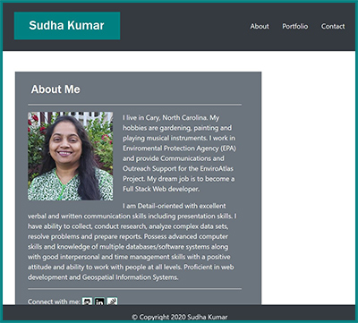

  

# Links to deployed application and repository:
* [Deployed Application](https://sskumar4.github.io/ResponsivePortfolio/)
* [Repository](https://github.com/sskumar4/ResponsivePortfolio)

# Project Name: Responsive Portfolio
# Title: Sudha Kumar 

# Introduction:   
Create a mobile responsive porfolio using boorstrap CSS Framework. Responsive design ensures that the web applications render well on a variety of devices or screen sizes

# Technologies: 
Bootstrap 4, HTML, CSS

# Features
Used sematic html
Created the following files: 
  * index.html, portfolio.html and contact.html 
Developed the site using bootstrap with the following features:
  * Responsive navbar with About, Portfolio and Contact links on the right and turns to a  hamburger menu for smaller devices
  * Responsive layout using grid system
  * Responsive images
  * A sticky footer
  * Used sub-rows and sub-columns
  * Added links to social media

Used HTML validation service to ensure that each page has valid HTML.

# Launch

Launch [Deployed Application](https://sskumar4.github.io/ResponsivePortfolio/) to view the About page. Click on links to the right of the navigation bar to navigate to the respective pages. The portfolio page contains links the completed portfolios and under construction pages. The contact page contains a form to send message to the site owner.

